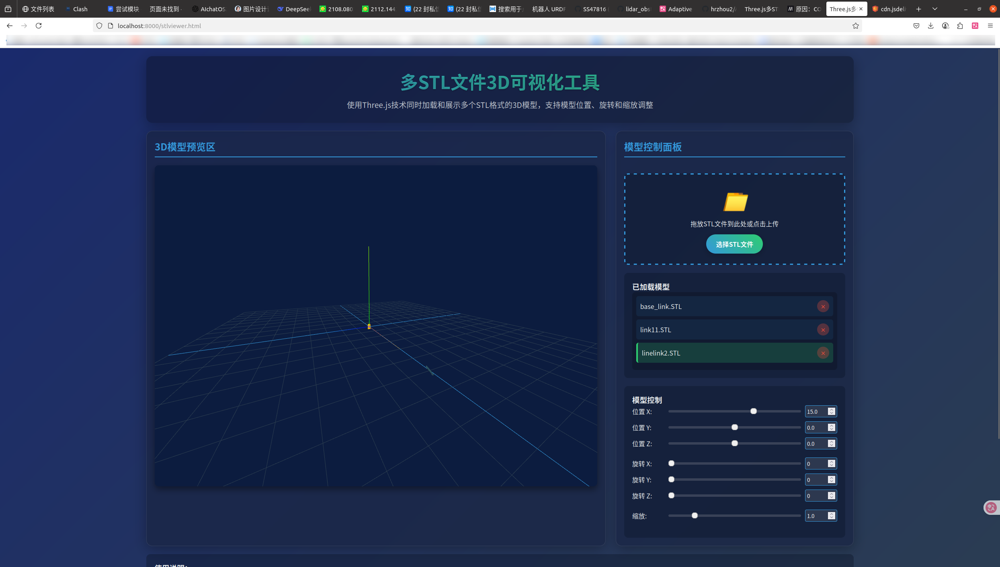
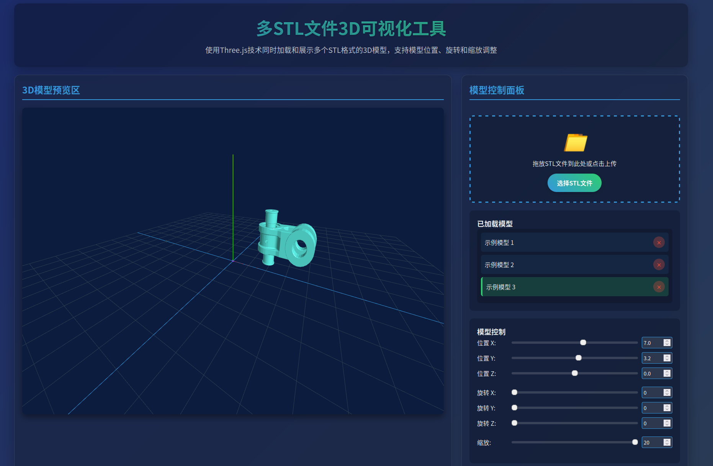

# 介绍
这是一个基于three.js的在线STL文件查看器，可以加载和显示STL格式的文件。

# 特点
- 支持加载STL文件并渲染3D模型
- 提供基本的交互功能，如旋转、缩放和平移视图等

# 如何使用

```shell
cd STLviewer/
python -m http.server 8000
```

然后打开浏览器访问 

http://localhost:8000/stlviewer.html




这里加载了一个模型：



网页下面自带使用说明

